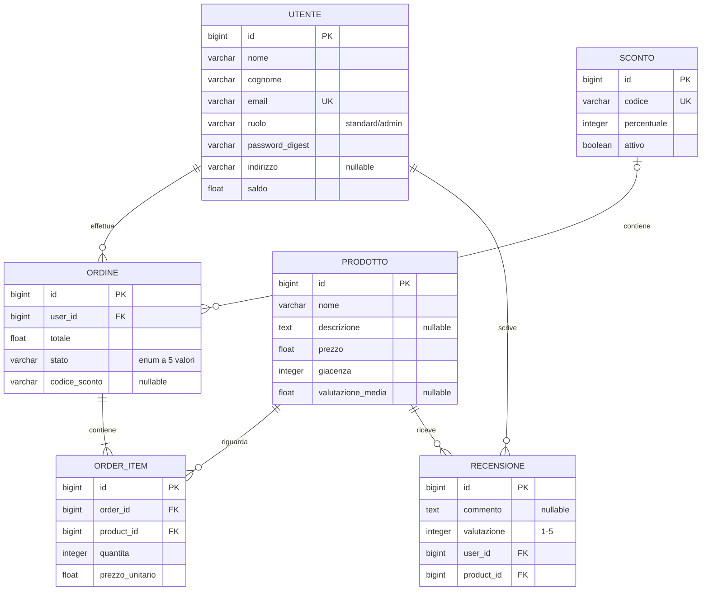

# Scopo e ambito

Il sistema è un e-commerce con un backend REST (FastAPI, PostgreSQL) e un frontend a pagina singola (Angular). Il frontend è solo abbozzato: il suo codice non fa parte di questo repository.

Gli utenti consultano il catalogo, acquistano prodotti pagando con un saldo interno, richiedono rimborsi e lasciano recensioni sui prodotti ricevuti. Gli amministratori gestiscono catalogo e giacenze e possono vedere tutti gli ordini.

Il saldo è un credito interno al sistema. Non sono stati realizzati i pagamenti con circuiti reali e la gestione del magazzino oltre alla giacenza.

## Prerequisiti

**Per l'avvio con Docker:**

- [Docker](https://docs.docker.com/get-docker/) con Docker Compose
- [Git](https://git-scm.com/) per clonare la repository

**Per l'avvio in locale e per i test:**

- [Python](https://www.python.org/downloads/) 3.11 o superiore
- [uv](https://docs.astral.sh/uv/getting-started/installation/) per gestire dipendenze ed esecuzione
- PostgreSQL attivo in locale (oppure un container Docker dedicato) per il database dell'applicazione e per quello di test
- Un file `.env` nella root con le variabili d'ambiente necessarie (vedi [`.env.example`](.env.example))

## Schema ER



## Avvio con Docker

Dopo aver clonato la repo, per avviare il sistema basta eseguire:

```bash
docker compose up -d --build
```

Una volta avviato:

- API: http://localhost:8000
- Documentazione interattiva (Swagger): http://localhost:8000/docs

## Avvio in locale

Per eseguire il sistema senza Docker serve il comando:

```bash
uv run uvicorn app.main:app --reload
```

## Test

Per eseguire i test:

```bash
uv run coverage run -m pytest && uv run coverage report
```

I test di integrazione richiedono un database PostgreSQL di test, configurato con la variabile `TEST_DATABASE_URL` da inserire in un file `.env` nella root.

## Documentazione

- [User Story](docs/user_story.md)
